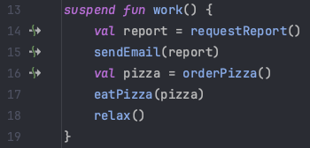

# Sekvensiell samtidighet

## Java

```java
public class Work {
  public CompletableFuture<Report> requestReport() {
  }

  public CompletableFuture<Void> sendEmail(Report content) {
  }

  public CompletableFuture<Pizza> orderPizza() {
  }

  public void eatPizza(Pizza pizza) {
  }

  public void relax() {
  }

  public void work() {
    requestReport()
      .thenCompose(report -> sendEmail(report))
      .thenCompose(_ -> orderPizza())
      .thenAccept(pizza -> eatPizza(pizza))
      .thenRun(() -> relax());
  }
}
```

## Kotlin

```kotlin
suspend fun requestReport(): Report {}

suspend fun sendEmail(report: Report) {}

suspend fun orderPizza(): Pizza {}

fun eatPizza(pizza: Pizza) {}

fun relax() {}

suspend fun work() {
  val report = requestReport()
  sendEmail(report)
  val pizza = orderPizza()
  eatPizza(pizza)
  relax()
}
```

- Kotlin skjuler pause/resume av suspendable functions
- **Suspension points** er kall til suspendable functions
- Vises i IntelliJ med et ikon i sidelinjen:



[Neste - kotlinx.coroutines](06-kotlinx.md)
